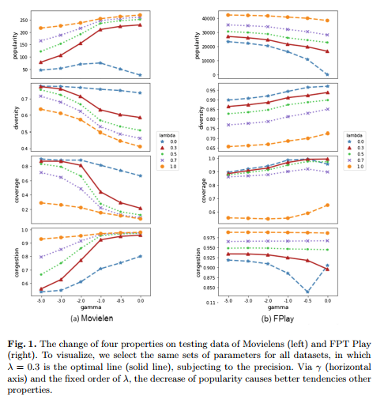

# Adaptive Collaborative Filtering for Recommender Systems (ACF)

Implementation of my publish [Adaptive Collaborative Filtering for Recommender Systems](https://doi.org/10.1007/978-3-030-23182-8_9), a graph-based model for large scale recommendation systems with the ability to automatically balance multiple evaluation metrics.

La A., Vo P., Vu T. (2019) Adaptive Collaborative Filtering for Recommender System. In: Endres D., Alam M., Şotropa D. (eds) Graph-Based Representation and Reasoning. ICCS 2019. Lecture Notes in Computer Science, vol 11530. Springer, Cham. https://doi.org/10.1007/978-3-030-23182-8_9

## 1. Matrix computing for AWC formula

The recommending formula of ACF is AWC (Adaptive Weighted Conduction). It balances multiple evaluation metrics at the same time. AWC can be represented as matrix multiplication. Checkout the folder [awc_matrix_computing](/awc_matrix_computing).

Requirement: numpy, pandas

Folders: [awc_matrix_computing](/awc_matrix_computing), [lib/utils](/lib/utils)

## 2. Large-scale recommending

The rest of the projects are large-scale recommending. History of users are represented as graph. The item-item matrix is calculated on graph, then recommending occurs in containers, each of them includes a pre-determined number of users.  

+ Requirement: numpy, pandas and C++ for graph.
+ To start running the code, check out [bash](/bash), where demo and recommending for MovieLen with multiple parameters are provided. These example includes automatically evaluating the result of recommending by 5 metrics: precicion, popularity, diversity, coverage and congestion.
+ Visualization of relationship between metric is implemented in [visualize](/visualize)

## 3. Sample dataset
 - [https://www.kaggle.com/carrie1/ecommerce-data](https://www.kaggle.com/carrie1/ecommerce-data)
 - [MovieLen 100k](https://grouplens.org/datasets/movielens/100k/)

